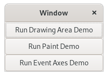
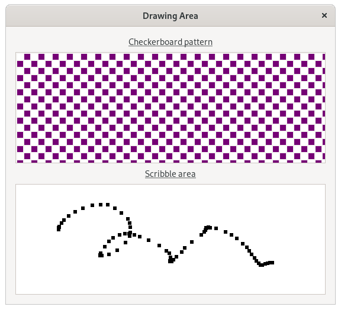
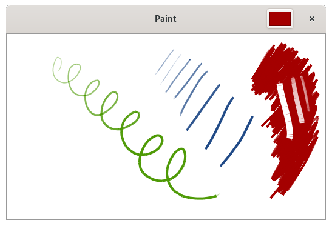
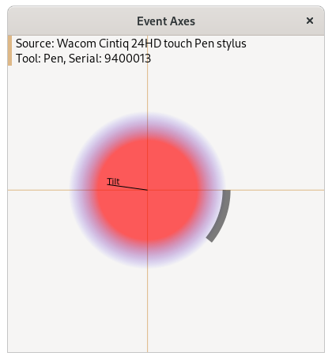

# Readme

## Introduction
This GTK+3 application is a collection of three tablet-related demos. These demos highlight how to read position, pressure, etc. from the tablet and render strokes to a GTK+ window. These demos have been extracted from the full ["gtk3-demo"](https://gitlab.gnome.org/GNOME/gtk/-/tree/gtk-3-24/demos/gtk-demo) program that comes with version 3.24 of the GTK+ library.

## Application Details
The application is composed of several C source files which handle independent parts of the demo:

|File				|Description											|Screenshot											|
|---					|---													|---												|
|```main.c```			|Initializes GTK+ and creates the main window. Clicking any button will launch the associated demo.	|		|
|```drawingarea.c```	|Self-contained demonstration of drawing to a ```GtkDrawingArea```. Highlights both static rendering and rendering in response to basic input events. Usable with a mouse as well as a tablet.|		|
|```paint.c```		|Self-contained demonstration of drawing to a custom drawing area in response to stylus and eraser events. Pressure- and tool-sensitive. Usable with a tablet only.|		|
|```event_axes.c```	|Self-contained demonstration of responding to and extracting data from stylus, eraser, and pad events. Sensitive to pressure, tilt, rotation, tool type, etc. Capable of handling multi-touch events. Usable with mouse, tablet, touchscreen, and other input devices.|	|

## See Also
[GTK+ Overview](https://developer-docs.wacom.com/wacom-device-api/docs/gtk-overview) - Introduction to the tablet-related APIs of GTK+3

## Where To Get Help
If you have questions about this demo, please visit our support page: https://developer.wacom.com/developer-dashboard/support. 

## License
This sample program is licensed under the GPL v2 License: https://opensource.org/licenses/gpl-2.0.php.